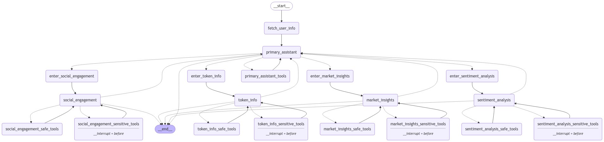
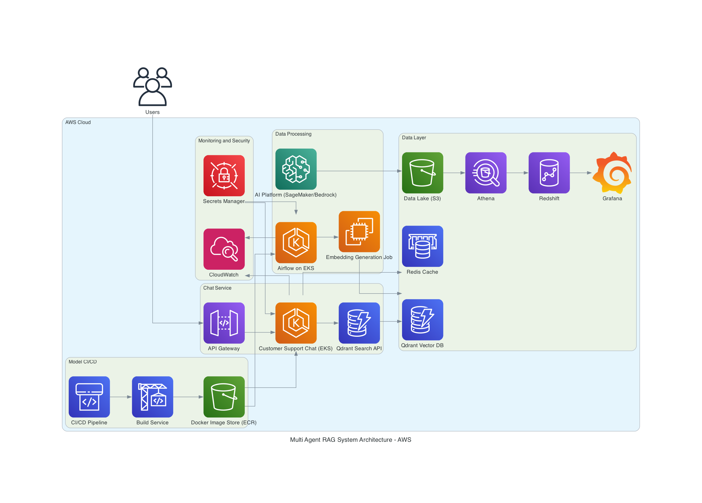
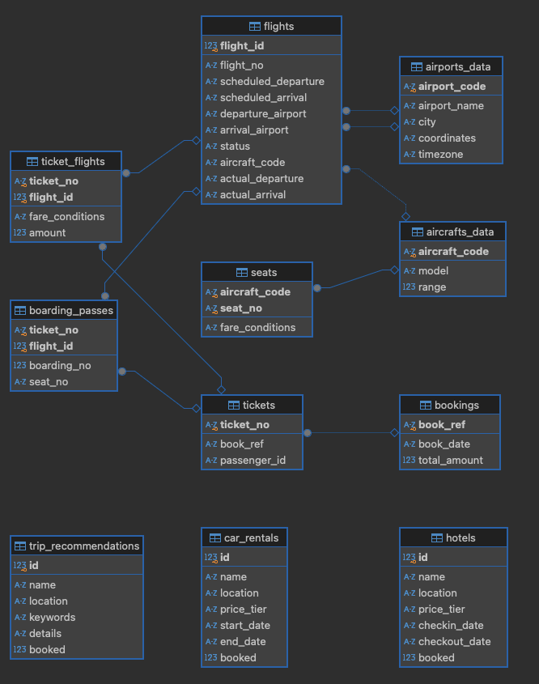
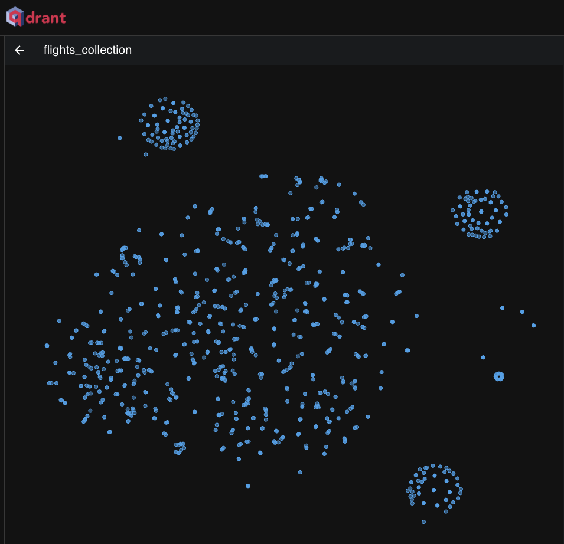

# Multi-Agent RAG Customer Support System

[ro-anderson](https://github.com/ro-anderson) | [LinkedIn](https://www.linkedin.com/in/ro-anderson/)

## What is this project?

This project implements a multi-agent Retrieval-Augmented Generation (RAG) system for customer support. It uses Python, LangChain, and LangGraph to create a conversational AI that can assist with various travel-related queries, including flight bookings, car rentals, hotel reservations, and excursions.


[Watch the demonstration video here](https://youtu.be/mPBYvSJuN8Q?si=TGmtyp-XK5O5xQV7)

### Multi-Agent RAG System Graph


## Architecture Overview
The system is built using a multi-agent architecture, implemented as a state graph using LangGraph. Here's a brief explanation of the main components:

1. **Primary Assistant**: This is the entry point for user queries. It routes the conversation to specialized assistants based on the user's needs.
2. **Specialized Assistants**:
    - **Flight Booking Assistant**: Handles flight-related queries and bookings.
    - **Car Rental Assistant**: Manages car rental requests.
    - **Hotel Booking Assistant**: Processes hotel reservation queries.
    - **Excursion Assistant**: Handles trip and excursion recommendations.
3. **Tool Nodes**: Each assistant has access to both *```safe```* and *```sensitive```* tools. Safe tools can be used without user confirmation, while sensitive tools require user approval before execution.
4. **Routing Logic**: The system uses *```conditional edges```* to route the conversation between assistants and *```tool nodes```* based on the current state and user input.
5. **User Confirmation**: For sensitive operations, the system pauses and asks for user confirmation before proceeding.
6. **Memory and State Management**: The system maintains conversation state and uses a *```memory checkpointer```* to save progress.

This architecture allows for a flexible and modular approach to handling diverse customer support scenarios, with built-in safety measures for sensitive operations.

## Observability in the Project
To ensure effective monitoring and debugging capabilities, the project integrates LangSmith for enhanced observability. LangSmith helps track the lifecycle of requests, including tool usage, agent responses, and errors, allowing developers to understand how the multi-agent system performs over time.

## Suggested Architecture on AWS

This architecture was designed with scalability, maintainability, and performance in mind. It focuses on creating efficient workflows across data engineering, machine learning, and AI deployment, ensuring that each component plays its role effectively. The design draws from my experience working closely with data engineering teams, as well as in roles as a Data Scientist, Machine Learning Engineer, and AI Engineer. It reflects a strong foundation in managing data pipelines, deploying machine learning models, and integrating AI solutions into real-world applications, while prioritizing security and reliability throughout the system.



### Data Layer

- ```S3 Data Lake```: Stores raw, intermediate, and processed data following a medallion architecture (Bronze, Silver, Gold). Data engineers manage these datasets, which are used for AI models and vector embeddings.
- ```Athena``` and ```Redshift```: Athena queries the S3 Data Lake, providing SQL-like access to large datasets. Redshift acts as the data warehouse for more complex and large-scale analytics tasks, providing a consolidated view of the processed data.
- ```Qdrant Vector Database``` (DynamoDB on the image): Stores and manages the vector embeddings generated by the system, enabling fast retrieval of relevant documents or information through vector search.
- ```ElastiCache``` (Redis): Serves as a cache and state management system, storing user session data and interactions for long-term memory in the chat service, enhancing user experience by allowing agents to retain historical context.

### Data Processing

- ```Airflow on EKS```: Manages the orchestration of scheduled tasks such as data processing and embedding generation. It ensures that the embeddings are up-to-date by running scheduled jobs.
- ```Embedding Generation Job``` (EC2): A dedicated job that generates embeddings for the processed data, which are stored in the Qdrant Vector Database. This is triggered as part of the data processing pipeline.
- ```SageMaker/Bedrock```: AWS machine learning services are used for training AI models and improving the performance of the support system. SageMaker allows for scaling and management of model training and deployment.

### Chat Service

- ```Customer Support Chat``` (EKS): The customer-facing chat service is hosted on Amazon EKS. It handles incoming user queries and delegates tasks to various agents. This component interfaces with the Qdrant database for vector search and the Redis cache for maintaining user session data.
- ```API Gateway```: Exposes the chat service API, acting as the entry point for client requests. It helps route user queries to the right service.
- ```Qdrant Search API```: Handles search queries against the Qdrant vector database, retrieving relevant data based on vector embeddings.

### Model CI/CD

- ```CodePipeline``` and ```CodeBuild```: The CI/CD pipeline automates the build and deployment process for both the vectorizer and the chat services. This allows for continuous updates to the system with minimal manual intervention.
- ```Docker Image Store``` (ECR): Stores the Docker images for the vectorizer and chat services, allowing for scalable deployment within EKS or other containerized environments.

### Monitoring and Security

- ```CloudWatch```: Monitors the system's health, logging performance metrics and triggering alerts for any issues across the chat service, embedding generation, and vector search.
- ```Secrets Manager```: Manages sensitive information such as API keys, database credentials, and other configuration secrets securely across the system.
- ```Grafana```: Provides real-time visualization and monitoring for data analytics, connected to Redshift for dashboarding insights from the underlying data.

## Requirements to Run Locally

- Python 3.12+
- [Poetry](https://python-poetry.org/docs/#installation)
- Docker and Docker Compose
- OpenAI API Key
- LangSmith API Key (optional, for tracing)

## How to run?

### Local Setup

1. Clone the repository and navigate to the project directory.

2. Create a `.env` file from `.dev.env`:
```bash
cp .dev.env .env
```


3. Edit the `.env` file and fill in the required values:

```bash
OPENAI_API_KEY="your_openai_api_key"
LANGCHAIN_API_KEY="your_langsmith_api_key" # Optional
```


4. Install dependencies:

```bash
poetry install
```


5. Generate embeddings:

```bash
poetry run python vectorizer/app/main.py
```


6. Start the Qdrant vector database:

```bash
docker compose up qdrant -d
```


   You can access the Qdrant UI at: http://localhost:6333/dashboard#

7. Run the customer support chat system:

```bash
poetry run python ./customer_support_chat/app/main.py
```

## Project Structure

This project consists of two main services:

1. **Vectorizer**: Generates embeddings for the knowledge base.
2. **Customer Support Chat**: The main conversational AI system.

The Customer Support Chat service depends on the vector database generated by the Vectorizer.

## Data Source and Vector Database

This project uses two main data sources:

1. Travel Database:
A travel database benchmark from LangGraph. This SQLite database contains information about flights, bookings, passengers, and other travel-related data.



Data source: [LangGraph Travel DB Benchmark](https://storage.googleapis.com/benchmarks-artifacts/travel-db)

2. Qdrant:
A vector database used to store and query the embeddings of the travel database.


## Code walkthrough of the services


- [vectorizer](./vectorizer/README.md)
- [customer_support_chat](./customer_support_chat/README.md)


## Next Steps on the Multi-Agentic RAG System
To continue improving the Multi-Agentic RAG System, here are some areas directly related to enhancing the current architecture:

```Refining the Tools:```
A lot of opportunities to improve the existing tools with advanced RAG techniques:
- Implement the [```Adaptive RAG approach```](https://langchain-ai.github.io/langgraph/tutorials/rag/langgraph_adaptive_rag/) in the existing search tools (search_flights, search_hotels, search_car_rentals, etc.) by integrating more nuanced filtering to improve retrieval accuracy from the vector database (VecDB).
- Apply [```Corrective RAG```](https://arxiv.org/abs/2401.15884) to the websearch tool when VecDB results are insufficient, ensuring fallback searches are more relevant and efficient.
- Utilize [```Self RAG```](https://langchain-ai.github.io/langgraph/tutorials/rag/langgraph_self_rag_local/) to evaluate if generated answers are grounded in retrieved data (from VecDB or web search). If not, the agent can request more accurate or additional information before responding, ensuring data integrity in its final output.

```Improving the Graph Architecture:```

- ```Graph Optimization```: Enhance the logic in graph.py by adding more detailed conditional paths for the different agents, ensuring better decision-making based on user queries and retrieved documents.

- ```Integrating Memory```:

- Implement a cache database to store user states and conversation history, allowing agents to reference past interactions for more personalized and context-aware responses.
User Feedback Loop:
